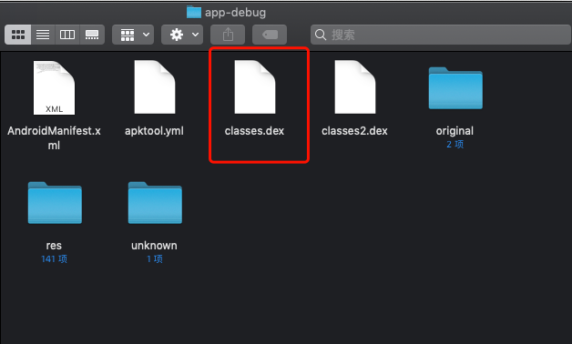
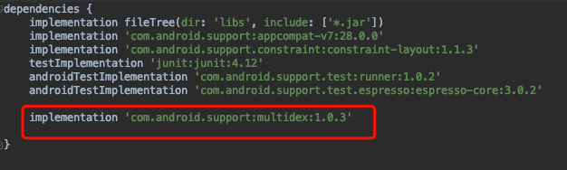
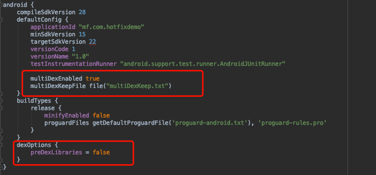
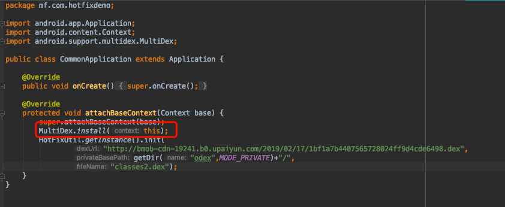
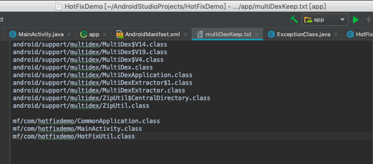

### 一。多分包

早期因为安卓方法id是short型存储，所以有方法书65535的限制，所以出现方法数超出时，需要缩减方法，但是做dex分包解决了这个问题，同时dex分包时热修复的前提。
安卓项目打包成apk文件需要这些步骤：aapt程序打包资源文件（包括R资源和assets资源），javac编译java文件为class文件，dx工具打包class文件为dex文件（一般只会出现一个classes.dex），然后组装成apk（之间包括配置文件和密钥处理）。
对apk文件反编译可以看到里面有一个主dex文件，里面是各种编译好的类。



不分包的话只有一个classes.dex。分包可以使单独的dex包内方法数不超过65535.
对build.gradle文件添加设置来引入dex分包功能。

#### 1.添加dex分包功能依赖包。



#### 2.设置启动多dex功能



上方multiDexEnable true设置启用多dex，multiDexKeepFile file("文件名")指定保留在主dex包中的模块（主dex包优先校验启动，引用其他dex包，并且主dex包中的类private方法，static方法，构造函数如果引用了外部类，外部类必须在主dex包中，否则找不到会出错。）。下方preDexLibraries=false指定不将用户依赖的library进行分包处理，避免出错。

#### 3.在application中启动多分包。



在application的回调中调用分包方法。

#### 4.关键的地方是设置哪些包可以放到主dex里面，写配置文件放到app目录下



### 二。热修复

由于可以对dex进行分包，于是有了热修复对应用进行更新的方式。
通常应用更新（比如出现小bug）都需要重新下载apk文件进行安装，用户体验不好。
而引入热修复之后，只需要替换dex包，用户看不到。

#### 热修复原理：

安卓dalvik虚拟机和java虚拟机不太一样，jar文件是jvm的可执行文件，dalvik的可执行文件是dex。
类加载时，会从主dex包开始寻找class文件，寻找到的class文件包括class依赖的class都会被预校验标记（防止方法被hook），因此如果方法被改了，但是发现和校验的方法不一样，就会报错。
类加载器会将加载到的dex生成Element实例存储在pathList的Elements数组中，供后面寻找class做准备，因此热修复做的是，在apllication每次启动时，通过反射方式将需要替换的dex放到Elements数组的最前面，这样类加载器先行寻找到class，就不会继续往下找，达到偷天换日的效果。

#### 具体热修复工具代码：

```java
import android.content.Context;
import android.util.Log;

import java.io.File;
import java.io.FileOutputStream;
import java.io.InputStream;
import java.lang.reflect.Array;
import java.lang.reflect.Field;
import java.net.HttpURLConnection;
import java.net.URL;
import java.util.concurrent.ExecutorService;
import java.util.concurrent.Executors;

import dalvik.system.DexClassLoader;

public class HotFixUtil {

    private static HotFixUtil instance;
    private HotFixUtil(){}
    public static HotFixUtil getInstance(){
        if(instance==null){
            synchronized (HotFixUtil.class){
                if(instance==null){
                    instance=new HotFixUtil();
                }
            }
        }
        return instance;
    }

    String TAG="HotFixUtil";
    ExecutorService executorService=Executors.newFixedThreadPool(1);

    public void init(final String dexUrl, final String privateBasePath , final String fileName){
        executorService.execute(new Runnable() {
            @Override
            public void run() {
                HttpURLConnection conn=null;
                try{
                    URL url=new URL(dexUrl);
                    conn= (HttpURLConnection) url.openConnection();
                    conn.setRequestMethod("GET");
                    conn.setReadTimeout(5000);
                    conn.setConnectTimeout(5000);
                    conn.connect();
                    int code=conn.getResponseCode();
                    if(code==200){
                        System.out.println("获取dex文件成功");
                        InputStream inputStream=conn.getInputStream();
                        System.out.println("创建了私有目录");
                        FileOutputStream fileOutputStream=new FileOutputStream(privateBasePath+fileName);
                        byte[] buffer=new byte[1024];
                        int len;
                        System.out.println("写入私有目录前");
                        while((len=inputStream.read(buffer))!=-1){
                            fileOutputStream.write(buffer,0,len);
                        }
                        inputStream.close();
                        fileOutputStream.close();
                        conn.disconnect();
                        System.out.println("成功写入dex文件到私有目录");
                    }
                }catch (Exception e){
                    e.printStackTrace();
                }
            }
        });
    }

    public void hotFix(final Context context,final String privateBasePath , final String fileName){
        File file = new File(privateBasePath+fileName);
        System.out.println(file.getAbsolutePath());
        if (file.exists()) {
            inject(context,privateBasePath+fileName);
            System.out.println("成功替换dex");
        } else {
            Log.e(TAG, privateBasePath+fileName + "不存在");
        }
    }

    private void inject(Context context,String path) {
        try {
            Class<?> cl = Class.forName("dalvik.system.BaseDexClassLoader");
            Object pathList = getField(cl, "pathList", context.getClassLoader());
            Object baseElements = getField(pathList.getClass(), "dexElements", pathList);
            String dexopt = context.getDir("dexopt", 0).getAbsolutePath();
            DexClassLoader dexClassLoader = new DexClassLoader(path, dexopt, dexopt, context.getClassLoader());
            Object obj = getField(cl, "pathList", dexClassLoader);
            Object dexElements = getField(obj.getClass(), "dexElements", obj);
            Object combineElements = combineArray(dexElements, baseElements);
            setField(pathList.getClass(), "dexElements", pathList, combineElements);
            Object object = getField(pathList.getClass(), "dexElements", pathList);
            int length = Array.getLength(object);
            Log.e(TAG, "length = " + length);
        } catch (ClassNotFoundException e) {
            e.printStackTrace();
        } catch (IllegalAccessException e) {
            e.printStackTrace();
        } catch (NoSuchFieldException e) {
            e.printStackTrace();
        }
    }

    private Object getField(Class<?> cl, String fieldName, Object object) throws NoSuchFieldException, IllegalAccessException {
        Field field = cl.getDeclaredField(fieldName);
        field.setAccessible(true);
        return field.get(object);
    }

    private void setField(Class<?> cl, String fieldName, Object object, Object value) throws NoSuchFieldException, IllegalAccessException {
        Field field = cl.getDeclaredField(fieldName);
        field.setAccessible(true);
        field.set(object, value);
    }

    private Object combineArray(Object firstArr, Object secondArr) {
        int firstLength = Array.getLength(firstArr);
        int secondLength = Array.getLength(secondArr);
        int length = firstLength + secondLength;
        Class<?> componentType = firstArr.getClass().getComponentType();
        Object newArr = Array.newInstance(componentType, length);
        for (int i = 0; i < length; i++) {
            if (i < firstLength) {
                Array.set(newArr, i, Array.get(firstArr, i));
            } else {
                Array.set(newArr, i, Array.get(secondArr, i - firstLength));
            }
        }
        return newArr;
    }
}
```
需要注意的是，操作文件必须在app的私有目录下。经过测试，热修复在线程中进行会失败，没有报错但不会成功。问题根源还不清楚，几百年用handler打通到主线程进行热修复依旧无法成功。然而通常热修复是通过网络下载dex文件进行处理，必定经过线程。
由于网络获取数据时间不可控加上文件读写，因此很难控制热修复调用时机。并且在热修复结束后需要延迟一段时间调用替换后的方法，否则同样会失败。